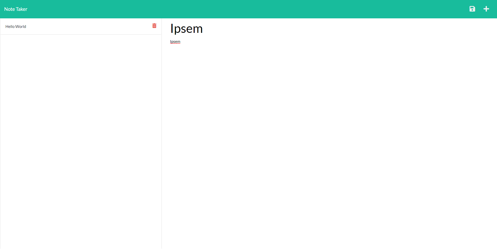

# Note Taker

  

  ## Table of Contents
  * [Description](#description)
  * [Installation](#installation)
  * [Usage](#usage)
  * [Contributors](#contribution)
  * [Tests](#test)
  * [License](#license)
  * [Questions](#questions)
  
  ## Description 
  This program was created for taking notes. You can give your note record a title. You can also save different notes and delete notes. This program was created so that the user can record anything they want and revisit the recorded data later on.
  
  ## Installation 
  Must have a code editor. Need to have a basic foundation of HTML, CSS, JavaScript, node.js, Express, and  OOP. Must have node.js, express module, and uuid module installed.

  ## Usage 
  To create and record notes.

  ## Contributors
  The project is open to contributions.

  ## Tests
  Follow the video added to the README.md file to see how to use this program.

  ## License 
  The application is covered under the ISC license.

  ## Image
  

  ## Deployable Site
  https://ancient-cliffs-25764.herokuapp.com/%20deployed%20to%20Heroku

  ## Questions
  You can search for my repo on GitHub by entering Bungycode and you can view my projects at https://github.com/Bungycode. If you have any questions, please contact me at thedevandrew@gmail.com

